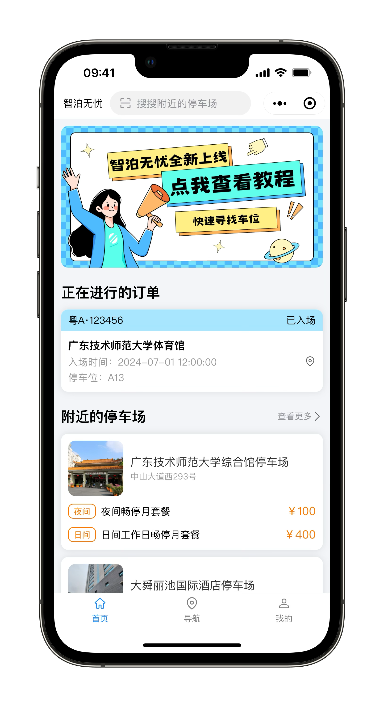
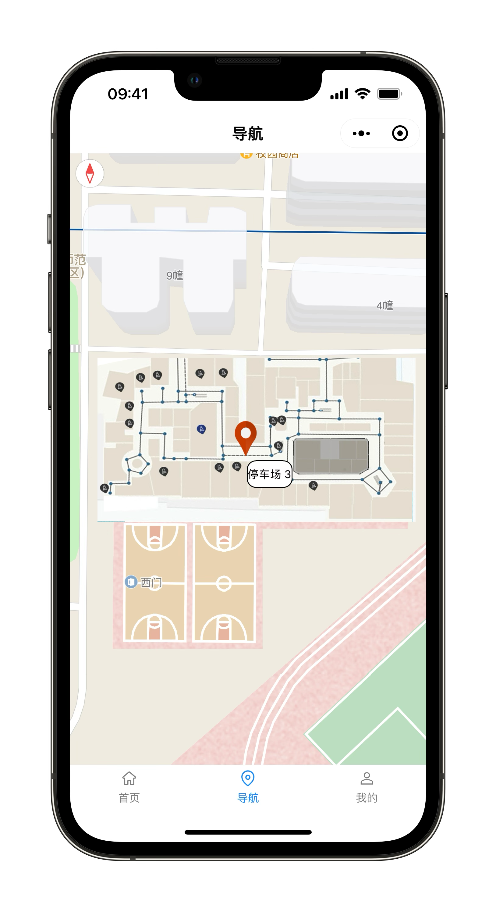
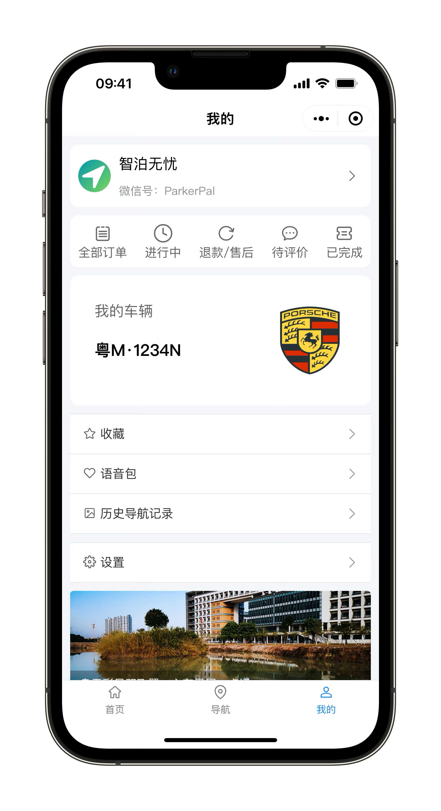

# ParkerPalApp

智泊无忧跨端应用

<div align="center">
  
  <p style="font-size: 24px; font-weight: bold;">智泊无忧</p>
</div>

<div align="center">
    
    
    
</div>

## 技术栈

uni-app、vue3、uview-plus、pinia

> 项目使用`esLint`和`stylelint`配合`husky`自动化校验代码规范

## 运行和部署

```bash
pnpm run dev:mp-weixin
```

> 注意！使用`unicloud`时配合`hbuild x`使用

## 开发规范

### 接口

服务端返回的结果统一为json格式，返回结果格式如下：

``` json
{
  "status": 0, // 状态码
  "msg": "", // 提示信息
  "data": {
    "code": 0 // 业务状态码（可选）
    // 业务数据
  }
}
```

获取用户信息成功的响应结果示例：

``` json
{
  "status": 200,
  "msg": "success",
  "data": {
    "code": 200,
    "info": {
      "id": "1",
      "name": "智泊无忧",
      "avatar": "",
      "weixinId": "ParkerPal"
    },
    "token": "eyJhbGciOiJIUz(省略后续内容)"
  }
}
```

获取用户信息失败的响应结果示例：

``` json
{
  "status": 403,
  "msg": "登录已失效",
  "data": ""
}
```

### 注意事项

1. 如果项目中不需要压缩图片，可以移除`vite-plugin-imagemin`插件后再初始化，以避免由于网路问题造成初始化报错的情况
2. 微信小程序开发者工具中内置的打包分析不准确，本项目使用了`rollup-plugin-visualizer`来分析小程序包体积，默认不开启，有需要的移除相关注释即可
3. 自动构建处理本地图片资源，使用了`vite-plugin-clean-build`和`vite-plugin-replace-image-url`这两个插件，默认不开启相关功能，如果需要使用再`build/vite/plugins/index.ts`文件中移除相关注释即可
4. 使用`vite-plugin-replace-image-url`插件，想要图片自动替换生效，需要在项目中使用绝对路径引入图片资源，如下示例所示。

    示例一：style中的图片使用

    ```vue
    <template>
      <view :style="`background-image: url('${bgImg}')`">
        <!-- else -->
      </view>
    </template>
    ```

    示例二：js中的图片使用

    ```vue
    <script setup lang="ts">
    import walletIcon from '@/static/images/icon_wallet.png'
    const menuList = [
      {
        name: 'wallet',
        title: '钱包',
        icon: walletIcon,
      },
      // else
    ]
    </script>
    ```

    示例二：css中的图片使用
    ```
    <style lang="scss">
    .icon {
      background-image: url('@/static/images/icon.png')
    }
    </style>
    ```

5. 本项目中`permission.ts`中的拦截代码在小程序中的`tab`切换中无效，下面是官方给出的回复及解决方案。

> 拦截uni.switchTab本身没有问题。但是在微信小程序端点击tabbar的底层逻辑并不是触发uni.switchTab。所以误认为拦截无效，此类场景的解决方案是在tabbar页面的页面生命周期onShow中处理。

6. 本项目使用了easycom自动导入，公共组件请遵循组件同名目录，eg:card/card.index。
